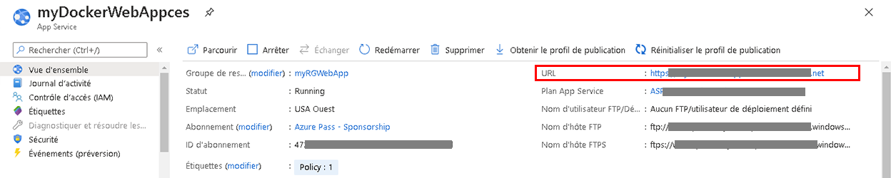
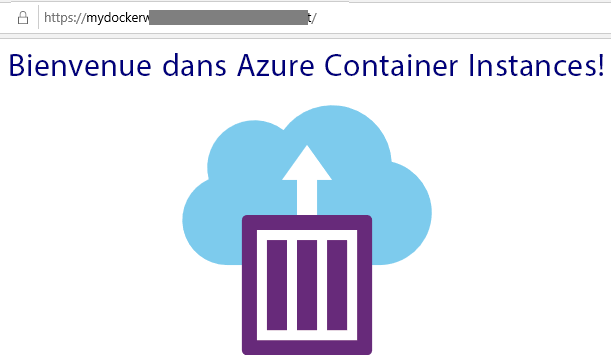

---
wts:
    title: '02 - Créer une application web (10 minutes)'
    module: 'Module 02 - Principaux services Azure (charges de travail)'
---
# 02 - Créer une application web (10 minutes)

Dans cette procédure pas à pas, nous allons créer une application web exécutant un conteneur Docker. Le conteneur Docker comporte un message de bienvenue. 

Azure App Service est constitué d’une série de quatre services, chacun d’entre eux étant conçu pour vous aider à héberger et à exécuter des applications web. Les quatre services (Web Apps, Mobile Apps, API Apps et Logic Apps) sont différents, mais au final, ils fonctionnent tous de manière très similaire. Les Web Apps sont les plus couramment utilisées des quatre services, et c’est le service que nous utiliserons dans ce labo.

# Tâche 1 : Créer une application web 

Dans cette tâche, vous allez créer une application web Azure App Service. 

1. Connectez-vous au [portail Azure](http://portal.azure.com/). 

2. Dans le panneau **Tous les services**, recherchez et sélectionnez **App Services**, puis cliquez sur **+ Ajouter, + Créer, + Nouveau**

3. Sous l’onglet **Bases** du panneau **Web App**, spécifiez les paramètres suivants (remplacez **xxxx** dans le nom de l’application web par des lettres et des chiffres afin que le nom soit unique). Conservez les valeurs par défaut pour tous les autres éléments, y compris le plan App Service. 

    | Paramètre | Valeur |
    | -- | -- |
    | Abonnement | **Utilisez la valeur par défaut fournie** |
    | Groupe de ressources | **Créer un groupe de ressources**|
    | Nom | **myDockerWebAppxxxx** |
    | Publier | **Conteneur Docker** |
    | Système d’exploitation | **Linux** |
    | Région | **USA Est** |
    
    **Remarque :** N’oubliez pas de remplacer la valeur **xxxx** pour que le nom de l’application web soit unique.

4. Cliquez sur **Suivant > Docker** et configurez les informations sur le conteneur.  

    | Paramètre | Valeur |
    | -- | -- |
    | Options | **Conteneur unique** |
    | Source d’image | **Docker Hub** |
    | Type d’accès | **Public** |
    | Image et étiquette | **mcr.microsoft.com/azuredocs/aci-helloworld** |
    
 **Remarque :** La commande start-up est facultative et n’est pas nécessaire dans cet exercice.

5. Cliquez sur **Examiner et créer**, puis cliquez sur **Créer**. 

# Tâche 2 : Tester l’application web

Dans cette tâche, nous allons tester l’application web.

1. Attendez que le déploiement de l’application web soit terminé.

2. Dans la zone **Notifications**, cliquez sur **Accéder à la ressource**. 

3. Dans le panneau **Présentation**, localisez l’**URL**. Copiez l’URL dans le Presse-papiers.

    

4. Dans une nouvelle fenêtre du navigateur, copiez l’URl et appuyez sur Entrée. Le message « Bienvenue dans Azure Container Instances » s’affiche.

    

5. Revenez au niveau du panneau **Présentation** de votre application web et faites-le défiler. Vous y remarquerez plusieurs graphiques de suivi des entrées/sorties des données et des demandes. Si vous répétez plusieurs fois l’étape 4, la télémétrie correspondante devrait s’afficher dans ces graphiques. Cela comprend le nombre de demandes et le temps de réponse moyen. 

**Remarque** : Pour éviter des coûts supplémentaires, vous pouvez supprimer ce groupe de ressources. Recherchez des groupes de ressources, cliquez sur votre groupe de ressources, puis sur **Supprimer le groupe de ressources**. Vérifiez le nom du groupe de ressources, puis cliquez sur **Supprimer**. Surveillez les **notifications** pour voir comment se déroule la suppression.

Félicitations, vous venez de créer une application Azure App Service.
