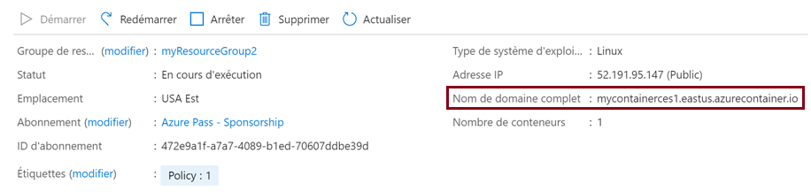
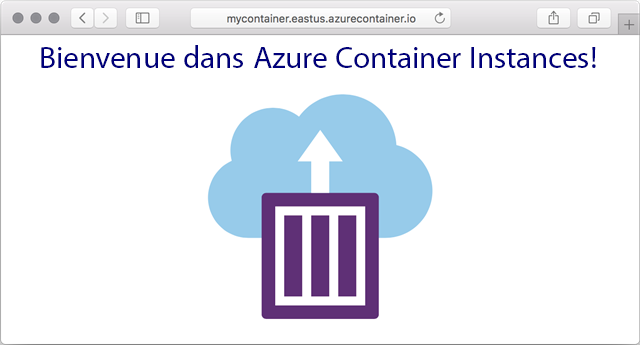

---
wts:
    title: '03 - Déployer Azure Container Instances (10 minutes)'
    module: 'Module 02 - Principaux services Azure (charges de travail)'
---

# 03 - Déployer Azure Container Instances (10 minutes)

Dans cette procédure pas à pas, nous allons créer, configurer et déployer un container à l’aide d’ ACI (Azure Container Instances) dans le portail Azure. Le conteneur est une application web Welcome to ACI qui affiche une page HTML statique. 

# Tâche 1 : Créer une instance de conteneur 

Dans cette tâche, nous allons créer une nouvelle instance de conteneur pour l’application web.  

1. Connectez-vous au [portail Azure](https://portal.azure.com).

2. Dans le panneau **Tous les services**, recherchez et sélectionnez **Container instances** puis cliquez sur **+ Ajouter, + Créer, + Nouveau**. 

3. Fournissez les détails de base suivants pour la nouvelle instance de conteneur (laissez les valeurs par défaut pour tous les autres éléments) : 

	| Paramètre| Valeur|
	|----|----|
	| Abonnement | ***Utilisez la valeur par défaut fournie*** |
	| Groupe de ressources | **Créer un groupe de ressources** |
	| Nom du conteneur| **mycontainer**|
	| Région | **(États-Unis) USA Est** |
	| Source d’image| **Docker Hub ou autre registre**|
	| Type d’image| **Publique**|
	| Image| **mcr.microsoft.com/azuredocs/aci-helloworld**|
	| Type de système d’exploitation| **Linux** |
	| Taille| ***Laissez la valeur par défaut***|

4. Configurez l’onglet Réseaux (remplacez **xxxx** par des lettres et des chiffres afin que le nom soit unique au monde). Pour les tous les autres Paramètres, utilisez les valeurs par défaut.

	| Paramètre| Valeur|
	|--|--|
	| Étiquette du nom DNS| **mycontainerdnsxxxxx** |

	
	**Remarque** : Votre conteneur sera accessible au public à l’adresse : dns-name-label.region.azurecontainer.io. Si vous recevez le message d’erreur **DNS name label not available** (Étiquette du nom DNS non disponible) à la fin du déploiement, spécifiez une autre étiquette du nom DNS (en remplaçant les valeurs de xxxxx) et procédez à un nouveau déploiement. 

5. Cliquez sur **Examiner et créer** pour lancer le processus de validation automatique.

6. Cliquez sur **Créer** pour créer l’instance de conteneur. 

7. Surveillez la page Déploiement et la page **Notifications**. 

# Tâche 2 : Vérifier le déploiement de l’instance de conteneur

Dans cette tâche, nous vérifierons que l’instance de conteneur est en cours d’exécution, en nous assurant que la page d’accueil s’affiche.

1. Une fois le déploiement terminé, cliquez sur le lien **Accéder à la ressource** sur le panneau de déploiement ou sur le lien vers la ressource dans la zone de notification.

2. Dans le panneau **Vue d’ensemble** de **mycontainer**, assurez-vous que le **Statut** de votre conteneur est bien **En cours d’exécution**. 

3. Recherchez le nom de domaine complet (FQDN, Fully Qualified Domain Name).

	

2. Copiez le nom de domaine complet (FQDN, Fully Qualified Domain Name) du conteneur dans un nouvel onglet du navigateur web et appuyez sur **Entrée**. La page d’accueil doit s’afficher. 

	

**Félicitations !** Vous avez utilisé le portail Azure pour déployer une application dans un conteneur dans Azure Container Instances.

**Remarque** : Pour éviter des coûts supplémentaires, vous pouvez supprimer ce groupe de ressources. Recherchez des groupes de ressources, cliquez sur votre groupe de ressources, puis sur **Supprimer le groupe de ressources**. Vérifiez le nom du groupe de ressources, puis cliquez sur **Supprimer**. Surveillez les **notifications** pour voir comment se déroule la suppression.
