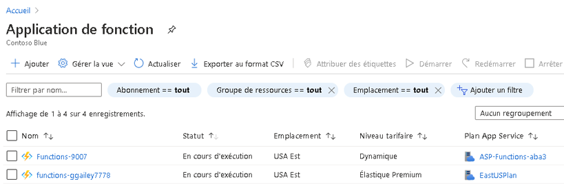
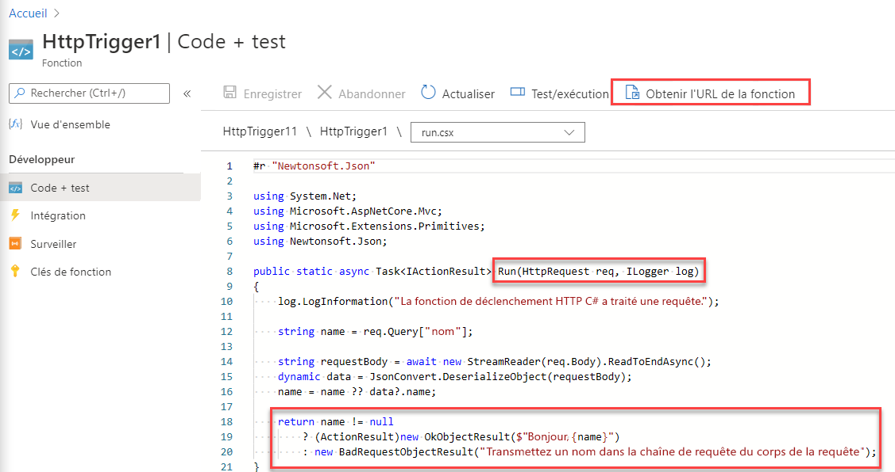
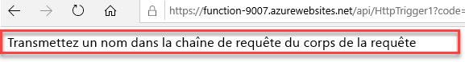
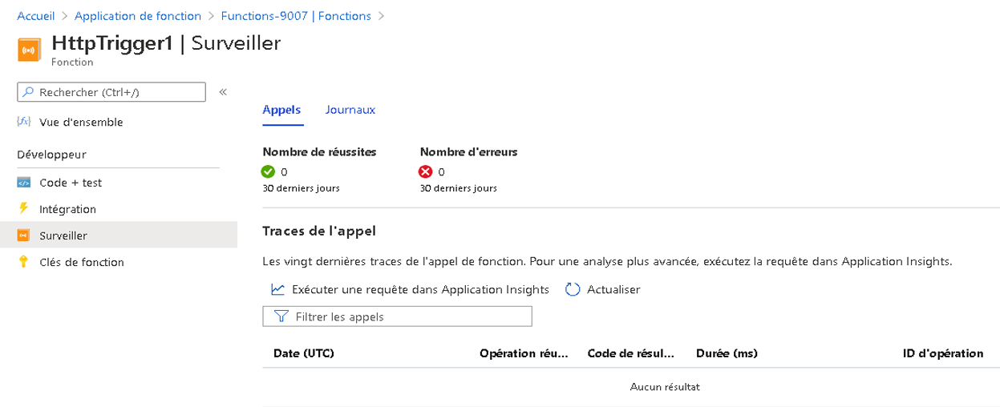

---
wts:
    title: '08 - Implémenter Azure Functions (5 minutes)'
    module: 'Module 03 : Décrire les solutions principales et les outils de gestion'
---
# 08 - Implémenter Azure Functions (5 minutes)

Dans cette procédure pas à pas, nous allons créer une application de fonction pour afficher un message Hello en cas de requête HTTP. 

# Tâche 1 : Créer une application de fonction 

Dans cette tâche, nous allons créer une application de fonction.

1. Connectez-vous au [portail Azure](https://portal.azure.com).

2. Dans la **barre de recherche** située en haut du portail, recherchez et sélectionnez **Function App** puis, dans le panneau **Function App**, cliquez sur **+ Ajouter**, **+ Créer**, **+ Nouveau**.

3. Sous l’onglet **Bases** du panneau **Application de fonction**, spécifiez les paramètres suivants (remplacez **xxxx** dans le nom de la fonction par des lettres et des chiffres de façon à ce que le nom soit unique au monde et maintenez les valeurs par défaut de tous les autres paramètres) : 

    | Paramètres | Valeur |
    | -- | --|
    | Abonnement | **Utilisez la valeur par défaut fournie** |
    | Groupe de ressources | **Créer un groupe de ressources** |
    | Nom de l’application de fonction | **fonction-xxxx** |
    | Publier | **Code** |
    | Pile d’exécution | **.NET** |
    | Version | **3,1** |
    | Région | **USA Est** |

    **Remarque** - Veillez à modifier la valeur **xxxx** pour créer un **nom d’application de fonction** unique

4. Cliquez sur **Examiner et créer** puis, après la validation, cliquez sur **Créer** pour commencer l’approvisionnement et le déploiement de votre nouvelle application de fonction Azure.

5. Attendez la notification indiquant que la ressource a bien été créée.

6. Une fois le déploiement terminé, cliquez sur Accéder à la ressource dans le panneau de déploiement. Une autre alternative consiste à revenir au niveau du panneau **Function App**, à cliquer sur **Actualiser** et à vérifier que la nouvelle application de fonction est effectivement dotée du statut **Running** (En cours d’exécution). 

    

# Tâche 2 : Créer une fonction déclenchée par requête HTTP et la tester

Dans cette tâche, nous allons utiliser la fonction Webhook + API pour afficher un message en cas de requête HTTP. 

1. Dans le panneau **Application de fonction**, cliquez sur l’application de fonction nouvellement créée. 

2. Dans le panneau Function App, dans la section **Functions** (Fonctions), cliquez sur **Functions** (Fonctions), puis sur **+ Ajouter**, **+ Créer**, **+ Nouveau**.

    

3. La fenêtre contextuelle **Ajouter une fonction** s’affiche dans le volet droit. Dans la section **Sélectionner un modèle**, cliquez sur **Déclencheur HTTP**. Cliquez sur **Ajouter**. 

    

4. Dans le panneau **HttpTrigger1**, dans la section **Développeur**, cliquez sur **Code + Test**. 

5. Dans le panneau **Code + Test**, examinez le code généré automatiquement et notez que le code est conçu pour exécuter une requête HTTP et des informations de traçage. Notez également que la fonction renvoie un message de type Hello avec un nom. 

    

6. Cliquez sur **Obtenir l’URL de la fonction** dans la partie supérieure de l’éditeur de fonctions. 

7. Assurez-vous que la valeur de la liste déroulante **Clé** est définie sur **Par défaut**, puis cliquez sur **Copier** pour copier l’URL de la fonction. 

    

8. Ouvrez un nouvel onglet de navigateur et collez l’URL de la fonction copiée dans la barre d’adresse de votre navigateur web. Lorsque la page sera demandée, la fonction s’exécutera. Notez le message renvoyé indiquant que la fonction nécessite un nom dans le corps de la demande.

    

9. Ajoutez **&name=*yourname*** à la fin de l’URL.

    **Remarque** : Par exemple, si votre nom est Cindy, l’URL final ressemblera à ceci : `https://azfuncxxx.azurewebsites.net/api/HttpTrigger1?code=X9xx9999xXXXXX9x9xxxXX==&name=cindy`

    

10. Lorsque vous appuyez sur Entrée, votre fonction est exécutée et toutes les invocations sont tracées. Pour visualiser le traçage, revenez dans le portail **httpTrigger1 \|** Panneau **Code + Test** et cliquez sur **Contrôler**. Vous pouvez **configurer** Application Insights en sélectionnant l’horodatage et en cliquant sur **Exécuter la requête dans Application Insights**.

     

Félicitations ! Vous avez créé une application de fonction pour afficher un message Hello en cas de requête HTTP.  

**Remarque** : Pour éviter des coûts supplémentaires, vous pouvez supprimer ce groupe de ressources. Recherchez des groupes de ressources, cliquez sur votre groupe de ressources, puis sur **Supprimer le groupe de ressources**. Vérifiez le nom du groupe de ressources, puis cliquez sur **Supprimer**. Surveillez les **notifications** pour voir comment se déroule la suppression.
