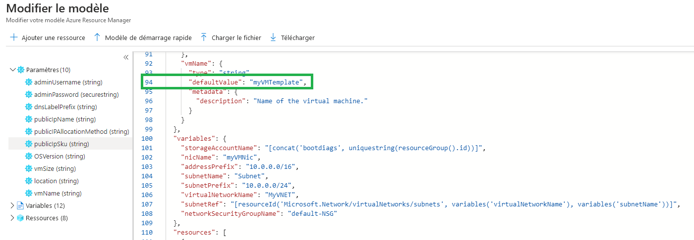
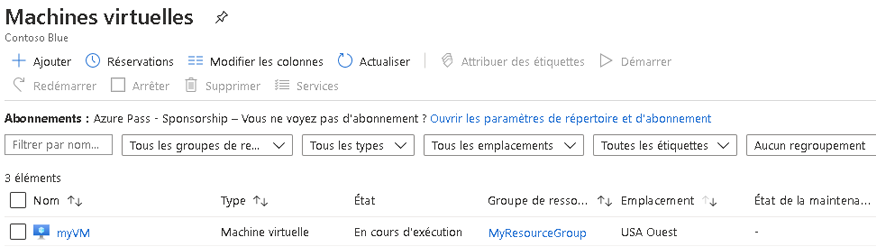
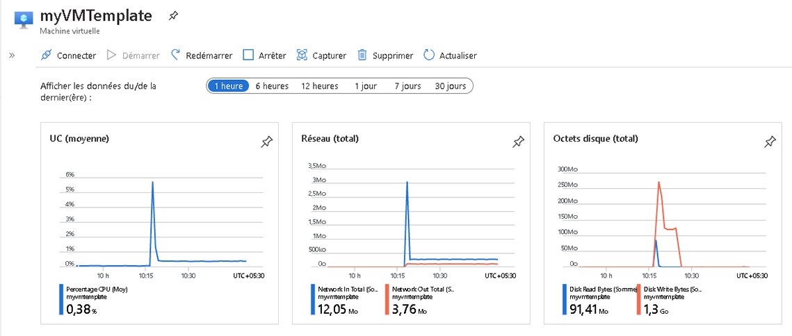
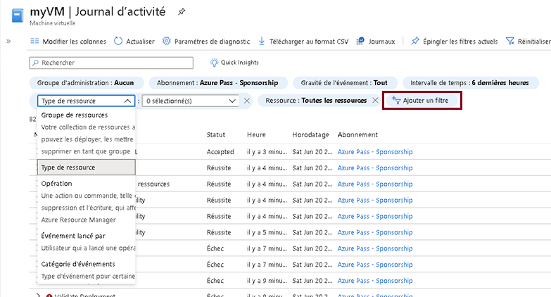

---
wts:
    title: '09 - Créer une machine virtuelle avec un modèle (10 minutes)'
    module: 'Module 03 - Décrire les solutions principales et les outils de gestion'
---
# 09 - Créer une machine virtuelle avec un modèle (10 minutes)

Dans cette procédure pas à pas, nous allons déployer une machine virtuelle avec un modèle de démarrage rapide et examiner ses capacités de surveillance.

# Tâche 1 : Explorer la galerie QuickStart (Démarrage rapide) et localiser un modèle 

Dans cette tâche, nous allons parcourir la galerie de démarrage rapide Azure et déployer un modèle qui crée une machine virtuelle. 

1. Au cœur de l’environnement de labo, ouvrez une nouvelle fenêtre de navigateur et entrez https://azure.microsoft.com/fr-fr/resources/templates/?azure-portal=true. Dans la galerie, vous trouverez un certain nombre de modèles courants et récemment mis à jour. Ces modèles automatisent le déploiement des ressources Azure, y compris l’installation de packages logiciels courants. Parcourez les différents types de modèles disponibles.

2. Sélectionnez l’option **Déployer une simple machine virtuelle Windows**

3. Cliquez sur le bouton **Déployer sur Azure**. Votre session de navigateur sera automatiquement redirigée vers le [portail Azure](http://portal.azure.com/).

  **Remarque** : Le bouton **Déployer sur Azure** vous permet de déployer le modèle via le portail Azure. Lors d’un tel déploiement, vous serez invité uniquement à définir un ensemble limité de paramètres de configuration. 

4. Lorsque vous y êtes invité, connectez-vous à votre abonnement Azure à l’aide des identifiants fournis précédemment dans les instructions.

5. Cliquez sur **Modifier le modèle**. Le format de modèle Resource Manager utilise le format JSON. Vérifiez les paramètres et les variables.  Localisez ensuite le paramètre du nom de la machine virtuelle. Remplacez le nom par **myVMTemplate**. **Enregistrez** vos modifications. 

    

6. Configurez ensuite les paramètres requis par le modèle (remplacez ***xxxx*** dans le préfixe d’étiquette DNS par des lettres et des chiffres, de sorte que l’étiquette soit unique au monde). Laissez les valeurs par défaut pour tous les autres éléments. 

    | Paramètre| Valeur|
    |----|----|
    | Abonnement | **Utilisez la valeur par défaut fournie**|
    | Groupe de ressources | **Créer un groupe de ressources** |
    | Région | Utilisez la valeur par défaut fournie |
    | Nom d’utilisateur administrateur | **azureuser** |
    | Mot de passe administrateur | **Pa$$w0rd1234** |
    | Préfixe d’étiquette DNS | **myvmtemplatexxxx** |
    | Version du SE | **2019-Datacenter** |

7. Cliquez sur **Examiner et créer**.

8. Surveillez votre déploiement. 

# Tâche 2 : Vérifiez et contrôlez le déploiement de votre machine virtuelle

Dans cette tâche, nous allons vérifier si la machine virtuelle s’est correctement déployée. 

1. Dans le panneau **Tous les services**, recherchez et sélectionnez **Machines virtuelles**.

2. Assurez-vous que votre nouvelle machine virtuelle a été créée. 

    

3. Sélectionnez votre machine virtuelle puis, dans le panneau **Présentation**, accédez à l’onglet **Surveillance** et faites défiler vers le bas pour afficher les données de surveillance.

    **Remarque** : Le délai de surveillance peut être ajusté, de une heure à 30 jours.

4. Passez en revue les différents graphiques fournis, y compris **UC (moyenne)**, **Réseau (total)**, et **Octets de disque (total)**. 

    

5. Cliquez sur un graphique. Remarquez que vous pouvez **Ajouter une mesure** et modifier le type de graphique.

6. Revenez au panneau **Vue d’ensemble**. (Pour cela, faites glisser la barre de défilement sur le côté gauche)
7. Cliquez sur le **journal d’activité** (volet gauche). Les journaux d’activité enregistrent des événements tels que la création ou la modification de ressources. 

8. Cliquez sur **Ajouter un filtre** et recherchez différents types d’événements et d’opérations afin de vous familiariser avec cette option. 

    

Félicitations ! Vous venez de créer une ressource à partir d’un modèle et vous avez déployé ce modèle dans Azure.

**Remarque** : Pour éviter des coûts supplémentaires, vous pouvez supprimer ce groupe de ressources. Recherchez des groupes de ressources, cliquez sur votre groupe de ressources, puis sur **Supprimer le groupe de ressources**. Vérifiez le nom du groupe de ressources, puis cliquez sur **Supprimer**. Surveillez les **notifications** pour voir comment se déroule la suppression.
