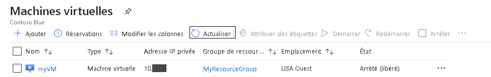
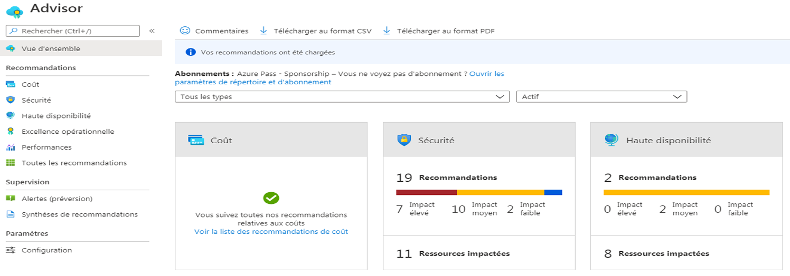
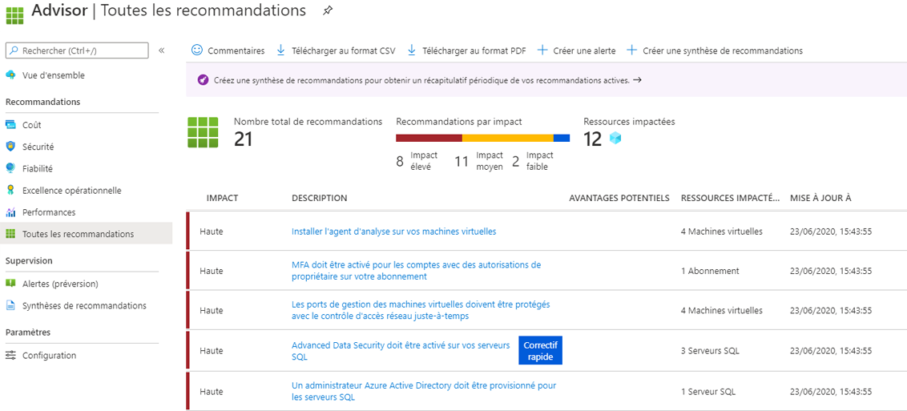

---
wts:
    title: '10 - Créer une machine virtuelle avec PowerShell (10 min)'
    module: 'Module 03 - Décrire les solutions principales et les outils de gestion'
---
# 10 - Créer une machine virtuelle avec PowerShell (10 min)

Dans cette procédure pas à pas, nous allons configurer Cloud Shell, utiliser le module Azure PowerShell pour créer un groupe de ressources et une machine virtuelle et, enfin, passer en revue les suggestions d’Azure Advisor. 

# Tâche 1 : Configurer Cloud Shell 

Dans cette tâche, nous allons configurer Cloud Shell. 

1. Connectez-vous au [portail Azure](https://portal.azure.com). **Vous trouverez vos identifiants de connexion sous l'onglet Ressources (situé juste à côté de l’onglet Instructions).**
2. Dans le portail Azure, ouvrez **Azure Cloud Shell** en cliquant sur l’icône située en haut à droite du portail Azure.

    

3. Lorsque vous êtes invité à sélectionner **Bash** ou **PowerShell**, sélectionnez **PowerShell**.

4. Dans l’écran **Vous n’avez aucun stockage monté**, sélectionnez **Afficher les paramètres avancés** puis renseignez les informations suivantes

    | Paramètres | Valeurs |
    |  -- | -- |
    | Groupe de ressources | **Créer un groupe de ressources** |
    | Compte de stockage (créez un nouveau compte et utilisez un nom unique au monde (par exemple: stockagecloudshellmonstockage)) | **cloudshellxxxxxxx** |
    | Partage de fichiers (nouveau) | **shellstorage** |

5. Sélectionnez **Créer un stockage**

# Tâche 2 : Créer un groupe de ressources et une machine virtuelle

Dans cette tâche, nous allons utiliser PowerShell pour créer un groupe de ressources et une machine virtuelle.  

1. Vérifiez que **PowerShell** est sélectionné dans le menu déroulant en haut à gauche du volet Cloud Shell.

2. Vérifiez votre nouveau groupe de ressources en exécutant en exécutant la commande suivante dans la fenêtre Powershell. Appuyez sur **Entrée** pour exécuter la commande.

    ```PowerShell
    Get-AzResourceGroup | Format-Table
    ```

3. Créez une machine virtuelle en collant la commande suivante dans la fenêtre du terminal. 

    ```PowerShell
    New-AzVm `
    -ResourceGroupName "myRGPS" `
    -Name "myVMPS" `
    -Location "East US" `
    -VirtualNetworkName "myVnetPS" `
    -SubnetName "mySubnetPS" `
    -SecurityGroupName "myNSGPS" `
    -PublicIpAddressName "myPublicIpPS"
    ```
    
4. Lorsque vous y serez invité, renseignez le nom d’utilisateur (**azureuser**) et le mot de passe (**Pa$$w0rd1234**) qui seront configurés pour le compte d’administrateur local sur ces machines virtuelles azureadmin

5. Une fois la machine virtuelle créée, fermez le panneau Cloud Shell de la session PowerShell.

6. Dans le portail Azure, recherchez les **machines virtuelles** et vérifiez que **myVMPS** est en cours d’exécution. Cette opération peut prendre quelques minutes.

    

7. Accédez à la nouvelle machine virtuelle et passez en revue les paramètres Vue d’ensemble et Réseaux pour vérifier que vos informations ont été correctement déployées. 

# Tâche 3 : Exécuter des commandes dans Cloud Shell

Dans cette tâche, nous nous entraînerons à exécuter des commandes PowerShell à partir de Cloud Shell. 

1. Dans le portail Azure, ouvrez **Azure Cloud Shell** en cliquant sur l’icône située en haut à droite du portail Azure.

2. Vérifiez que **PowerShell** est sélectionné dans le menu déroulant en haut à gauche du volet Cloud Shell.

3. Accédez aux informations concernant votre machine virtuelle, notamment le nom, le groupe de ressources, l’emplacement et l’état. Notez que PowerState indique **Exécution en cours**.

    ```PowerShell
    Get-AzVM -name myVMPS -status | Format-Table -autosize
    ```

4. Arrêtez la ressource d’adresse IP virtuelle à l’aide de la commande suivante. 

    ```PowerShell
    Stop-AzVM -ResourceGroupName myRGPS -Name myVMPS
    ```
5. À l’invite, confirmez (Oui) l’action. Attendez l’affichage du statut **Opération réussie**.

6. Vérifiez l’état de votre machine virtuelle. PowerState doit maintenant indiquer **Désalloué**. Vous pouvez également vérifier l’état de la machine virtuelle dans le portail. Fermez Cloudshell.

    ```PowerShell
    Get-AzVM -name myVMPS -status | Format-Table -autosize
    ```

# Tâche 4 : Consulter les suggestions dans Azure Advisor

**Remarque :** Cette même tâche est proposée dans le labo Créer une machine virtuelle avec Azure CLI. 

Dans cette tâche, nous allons passer en revue les suggestions proposées dans Azure Advisor pour notre machine virtuelle. 

1. Dans le panneau **Tous les services**, recherchez et sélectionnez **Advisor**. 

2. Dans le panneau **Advisor**, sélectionnez **Vue d’ensemble**. Les suggestions sont regroupées par fiabilité, sécurité, niveau de performance et coût. 

    

3. Sélectionnez **Toutes les suggestions** et prenez le temps de consulter toutes les suggestions et actions suggérées. 

    **Remarque :** Selon vos ressources, vos suggestions peuvent différer. 

    

4. Notez que vous pouvez télécharger les suggestions au format CSV ou PDF. 

5. Notez également que vous pouvez créer des alertes. 

6. Si vous avez le temps, continuez à expérimenter Azure PowerShell. 

Félicitations ! Vous avez configuré Cloud Shell, créé une machine virtuelle à l’aide de PowerShell, utilisé des commandes PowerShell et consulté les suggestions Advisor.

**Remarque** : Pour éviter des coûts supplémentaires, vous pouvez supprimer ce groupe de ressources. Recherchez des groupes de ressources, cliquez sur votre groupe de ressources, puis sur **Supprimer le groupe de ressources**. Vérifiez le nom du groupe de ressources, puis cliquez sur **Supprimer**. Surveillez les **notifications** pour voir comment se déroule la suppression.
