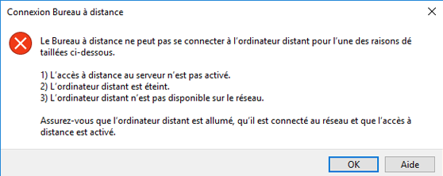

---
wts:
    title: '13 - Sécuriser le trafic réseau (10 minutes)'
    module: 'Module 04 - Description des fonctionnalités de sécurité générale et de sécurité réseau'
---
# 13 - Sécuriser le trafic réseau (10 minutes)

Dans cette procédure pas à pas, nous allons configurer un groupe de sécurité réseau.

# Tâche 1 : Créer une machine virtuelle

Dans cette tâche, nous allons créer une machine virtuelle de base de données Windows Server 2019. 

1. Connectez-vous au [portail Azure](https://portal.azure.com).

2. Dans le panneau **Tous les services**, recherchez et sélectionnez **Machines virtuelles**, puis cliquez sur **+ Ajouter, + Créer, + Nouveau**.

3. Sous l’onglet **Informations de base** renseignez les informations suivantes (conservez les valeurs par défaut pour toutes les autres options) :

    | Paramètres | Valeurs |
    |  -- | -- |
    | Abonnement | **Utilisez la valeur par défaut fournie** |
    | Groupe de ressources | **Créer un groupe de ressources** |
    | Nom de la machine virtuelle | **SimpleWinVM** |
    | Région | **(États-Unis) USA Est**|
    | Image | **Windows Server 2019 Datacenter Gen 2**|
    | Taille | **Standard D2s v3**|
    | Nom d’utilisateur du compte d’administrateur | **azureuser** |
    | Mot de passe du compte d’administrateur | **Pa$$w0rd1234**|
    | Règles des ports d’entrée | **Aucune**|

4. Accédez à l’onglet **Mise en réseau** et configurez le paramètre suivant :

    | Paramètres | Valeurs |
    | -- | -- |
    | Groupe de sécurité réseau de la carte réseau | **Aucune**|

5. Sous l’onglet **Gestion**, dans la section **Contrôle** , sélectionnez le paramètre suivant :

    | Paramètres | Valeurs |
    | -- | -- |
    | Diagnostics de démarrage | **Désactiver**|

6. Conservez les autres valeurs par défaut, puis cliquez sur le bouton **Examiner et créer** au bas de la page.

7. Une fois la validation réussie, cliquez sur le bouton **Créer**. Il faut environ cinq minutes pour déployer la machine virtuelle.

8. Surveillez le déploiement. La création du groupe de ressources et de la machine virtuelle peut prendre quelques minutes. 

9. Dans le panneau de déploiement ou dans la zone de notification, cliquez sur **Accéder à la ressource**. 

10. Sur le panneau de la machine virtuelle **SimpleWinVM**, cliquez sur **Mise en réseau** et, sous l’onglet **Règles de port entrant** vérifiez qu’aucun groupe de sécurité réseau n’est associé à l’interface réseau de la machine virtuelle ou au sous-réseau auquel l’interface réseau est connectée.

    **Remarque** : Identifiez le nom de l’interface réseau. Vous en aurez besoin dans la prochaine tâche.

# Tâche 2 : Créer un groupe de sécurité réseau

Dans cette tâche, nous allons créer un groupe de sécurité réseau et l’associer à l’interface réseau. 

1. Dans le panneau **Tous les services**, recherchez et sélectionnez **Groupes de sécurité réseau**, puis cliquez sur **+ Ajouter, + Créer, + Nouveau**

2. Sous l’onglet **Informations de base** du panneau **Créer un groupe de sécurité réseau**, spécifiez les paramètres suivants.

    | Paramètre | Valeur |
    | -- | -- |
    | Abonnement | **Utilisez l’abonnement par défaut** |
    | Groupe de ressources | **Sélectionnez la valeur par défaut dans la liste déroulante** |
    | Nom | **myNSGSecure** |
    | Région | **(États-Unis) USA Est**  |

3. Cliquez sur **Examiner et créer** puis, après la validation, cliquez sur **Créer**.

4. Une fois le NSG créé, cliquez sur **Accéder à la ressource**.

5. Sous **Paramètres** cliquez sur **Interfaces réseau**, puis sur **Associer**.

6. Sélectionnez l’interface réseau que vous avez identifiée dans la tâche précédente. 

# Tâche 3 : Configurer une règle de port de sécurité entrante pour autoriser RDP

Dans cette tâche, nous autoriserons le trafic RDP vers la machine virtuelle en configurant une règle de sécurité de trafic entrant pour un port. 

1. Dans le Portail Azure, accédez au panneau de la machine virtuelle **SimpleWinVM**. 

2. Dans le panneau **Vue d’ensemble**, cliquez sur **Connecter**.

3. Tentez de vous connecter à la machine virtuelle en sélectionnant RDP, puis en téléchargeant et en exécutant le fichier RDP. Par défaut, le groupe de sécurité réseau n’autorise pas le protocole RDP. Fermez la fenêtre d’erreur. 

    

4. Dans le panneau de la machine virtuelle, défilez vers le bas jusqu’à la section **Paramètres**, cliquez sur **Réseau**, puis notez les règles de trafic entrant pour **myNSGSecure (attached to network interface: myVMNic)**. Le groupe de sécurité réseau refuse tout trafic entrant, à l’exception du trafic au sein du réseau virtuel et des sondes de l’équilibreur de charge.

5. Sous l’onglet **Règles de port entrant**, cliquez sur **Ajouter une règle de port entrant**. Cliquez sur **Ajouter** une fois que vous avez terminé. 

    | Paramètre | Valeur |
    | -- | -- |
    | Source | **Toutes**|
    | Plages de ports sources | **\*** |
    | Destination | **N’importe laquelle** |
    | Plages de ports de destination | **3389** |
    | Protocole | **TCP** |
    | Action | **Autoriser** |
    | Priorité | **300** |
    | Nom | **Autoriser RDP** |

6. Sélectionnez **Ajouter**, attendez que la règle soit provisionnée puis tentez à nouveau d’autoriser RDP dans la machine virtuelle en activant de nouveau l’option **Connexion**. Ceci devrait produire un résultat satisfaisant. N’oubliez pas que l’utilisateur est **azureuser** et que le mot de passe est **Pa$$w0rd1234**.

# Tâche 4 : Configurer une règle de port de sécurité sortante pour refuser l’accès à Internet

Dans cette tâche, nous allons créer une règle de port de sortie NSG qui refusera l’accès à Internet, puis vérifier que cette règle fonctionne.

1. Continuez dans votre session RDP de machine virtuelle. 

2. Après le démarrage de la machine, ouvrez un navigateur **Internet Explorer**. 

3. Vérifiez que vous pouvez accéder à **https://www.bing.com** puis fermez Internet Explorer. Vous devrez utiliser les fenêtres contextuelles de sécurité renforcée d’IE. 

    **Remarque** : Nous allons maintenant configurer une règle pour refuser l’accès Internet sortant. 

4. Revenez dans le Portail Azure et accédez de nouveau au panneau de la machine virtuelle **SimpleWinVM**. 

5. En dessous de **Paramètres**, cliquez sur **Mise en réseau**, puis sur **Règles de port de sortie**.

6. Remarquez qu’il existe une règle nommée **AllowInternetOutbound**. Il s’agit d’une règle par défaut, qui ne peut pas être supprimée. 

7. Cliquez sur **Ajouter une règle de port de sortie** à droite du groupe de sécurité réseau **myNSGSecure (attaché à l’interface réseau : myVMNic)** et configurez une nouvelle règle de sécurité sortante avec une priorité plus élevée qui refusera le trafic Internet. Lorsque vous avez terminé, cliquez sur **Ajouter**. 

    | Paramètre | Valeur |
    | -- | -- |
    | Source | **Toutes**|
    | Plages de ports sources | **\*** |
    | Destination | **Étiquette du service** |
    | Identification de destination | **Internet** |
    | Plages de ports de destination | **\*** |
    | Protocole | **TCP** |
    | Action | **Refuser** |
    | Priorité | **4000** |
    | Nom | **Refuser Internet** |

8. Cliquez sur **Ajouter** pour revenir au niveau de la machine virtuelle pour laquelle vous avez autorisé RDP. 

9. Accédez à **https://www.microsoft.com**. La page ne doit pas s’afficher. Vous devrez peut-être utiliser des fenêtres contextuelles de sécurité renforcée IE supplémentaires.  

**Remarque** : Pour éviter des coûts supplémentaires, vous pouvez supprimer ce groupe de ressources. Recherchez des groupes de ressources, cliquez sur votre groupe de ressources, puis sur **Supprimer le groupe de ressources**. Vérifiez le nom du groupe de ressources, puis cliquez sur **Supprimer**. Surveillez les **notifications** pour voir comment se déroule la suppression.
